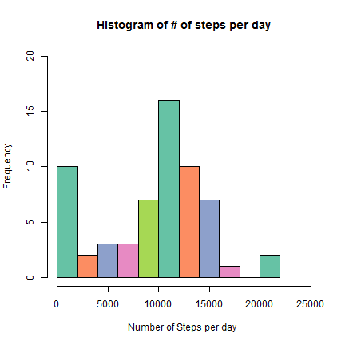
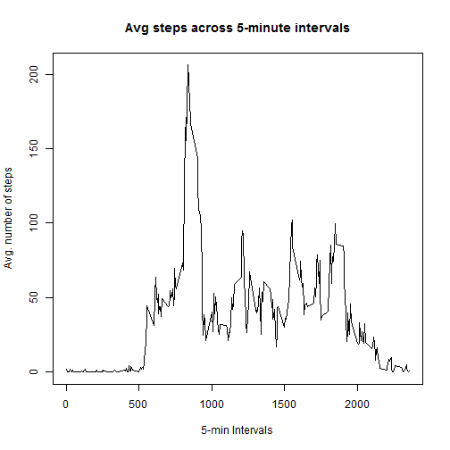
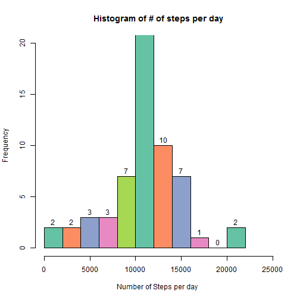
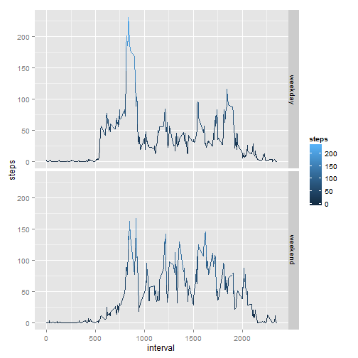

## I Loading and preprocessing the data

### 1.1 Load the data

Ensure your session is pointing to the directory with the csv file.Use read.csv command to load the data.

```r
A <- read.csv("activity.csv")
```

### 1.2 Preprocess the data
Check structure of the loaded dataset with str. Review elements of the dataset using head.Convert the loaded data set into a data frame. Load package for coloring the graphs. Load library for ggplot2.


```r
str (A)
```

```
## 'data.frame':	17568 obs. of  3 variables:
##  $ steps   : int  NA NA NA NA NA NA NA NA NA NA ...
##  $ date    : Factor w/ 61 levels "2012-10-01","2012-10-02",..: 1 1 1 1 1 1 1 1 1 1 ...
##  $ interval: int  0 5 10 15 20 25 30 35 40 45 ...
```

```r
head(A)
```

```
##   steps       date interval
## 1    NA 2012-10-01        0
## 2    NA 2012-10-01        5
## 3    NA 2012-10-01       10
## 4    NA 2012-10-01       15
## 5    NA 2012-10-01       20
## 6    NA 2012-10-01       25
```

```r
A <- data.frame(A)
options(warn = -1)
require(RColorBrewer)
library(ggplot2)
```
## II What is the mean total number of steps taken per day?

### 2.1 Calculate the total number of steps taken per day 
Use tapply to calculate the total number of steps per day. Omit missing values.

```r
AMOD <- tapply(A$steps, A$date, sum, na.rm = TRUE)
head (AMOD)
```

```
## 2012-10-01 2012-10-02 2012-10-03 2012-10-04 2012-10-05 2012-10-06 
##          0        126      11352      12116      13294      15420
```
### 2.2 Make a histogram of the total number of steps taken each day 
Call hist function to make a histogram of data from previous step

```r
hist( AMOD, breaks = 10, lables = TRUE, ylim = c(0, 20), xlim = c(0, 25000), main="Histogram of # of steps per day", xlab="Number of Steps per day ", col = brewer.pal(5, "Set2"))
```

 


###2.3 Calculate and report the mean and median of the total number of steps taken per day 


```r
mean(AMOD)
```

```
## [1] 9354.23
```

```r
median(AMOD)
```

```
## [1] 10395
```
Mean of the total number of steps taken per day is 9354.23
Median of the total number of steps taken per day is 10395

## III What is the average daily activity pattern?
### 3.1 Make a time series plot of the 5-minute interval and the average number of steps taken


```r
BMOD <- tapply(A$steps, A$interval, mean, na.rm = TRUE)
BMODName <- as.numeric(names(BMOD))
plot(BMODName, BMOD, type = "l", , main = "Avg steps across 5-minute intervals", xlab = "5-min Intervals", ylab = "Avg. number of steps")
```

 

### 3.2 Which 5-minute interval, on average across all the days in the dataset, contains the maximum number of steps?
On average the maximum number of steps is 206. 

The five minute interval number that contains the maximum number of steps is 104 th of the 288 total intervals. The interval is:

```r
names(BMOD)[which(grepl(max(BMOD), BMOD))]
```

```
## [1] "835"
```
## IV Imputing missing values
### 4.1 Calculate and report the total number of missing values in the dataset 
The total number of missing values is NA's   :2304  .

```r
summary(A)
```

```
##      steps                date          interval     
##  Min.   :  0.00   2012-10-01:  288   Min.   :   0.0  
##  1st Qu.:  0.00   2012-10-02:  288   1st Qu.: 588.8  
##  Median :  0.00   2012-10-03:  288   Median :1177.5  
##  Mean   : 37.38   2012-10-04:  288   Mean   :1177.5  
##  3rd Qu.: 12.00   2012-10-05:  288   3rd Qu.:1766.2  
##  Max.   :806.00   2012-10-06:  288   Max.   :2355.0  
##  NA's   :2304     (Other)   :15840
```
### 4.2 Devise a strategy for filling in all of the missing values in the dataset.
Relplace missing value by mean of the number of steps in a given interval


```r
L <- BMOD[match(A$interval, names(BMOD))]
I.steps <- ifelse(is.na(A$steps), L, A$steps)
```
### 4.3 Create a new dataset that is equal to the original dataset but with the missing data filled in.
Creating a new dataset by replacing the steps column by Imputed steps column in A. 


```r
NEWA <- A
NEWA$steps <- I.steps
names(NEWA)[1] <- "I.steps"
str(NEWA)
```

```
## 'data.frame':	17568 obs. of  3 variables:
##  $ I.steps : num  1.717 0.3396 0.1321 0.1509 0.0755 ...
##  $ date    : Factor w/ 61 levels "2012-10-01","2012-10-02",..: 1 1 1 1 1 1 1 1 1 1 ...
##  $ interval: int  0 5 10 15 20 25 30 35 40 45 ...
```
### 4.4 (a) Make a histogram of the total number of steps taken each day
Use tapply to generate the column of data with total number of steps by day. Use hist to plot the histogram.


```r
IAMOD <- tapply(NEWA$I.steps, NEWA$date, sum)
hist( IAMOD, breaks = 10, labels = TRUE, ylim = c(0, 20), xlim = c(0, 25000), main="Histogram of # of steps per day", xlab="Number of Steps per day ", col = brewer.pal(5, "Set2"))
```

 

### 4.4 (b) Calculate and report the mean and median of total number of steps taken per day

```r
mean(IAMOD)
```

```
## [1] 10766.19
```

```r
median(IAMOD)
```

```
## [1] 10766.19
```
Mean of the total number of imputed steps taken per day is 1.076619 &times; 10<sup>4</sup>

Median of the total number of imputed steps taken per day is 1.0766189 &times; 10<sup>4</sup>

The difference between the means (total steps, total imputed steps) is -1411.96

The difference between the medians (total steps, total imputed steps) is -371.1886792. The mean and median increase after imputation.

## V Weekdays and weekends activity patterns
### 5.1 Create a new factor variable for weekdays and weekends
Use ifelse function to compute a vector of weekday/weekend. Column bind this vector to NEWA dataset.

```r
day <- weekdays(as.Date(NEWA$date))
type <- ifelse(day %in% c("Saturday", "Sunday"), "weekend", "weekday")
M1 <- cbind(NEWA, type)
str(M1)
```

```
## 'data.frame':	17568 obs. of  4 variables:
##  $ I.steps : num  1.717 0.3396 0.1321 0.1509 0.0755 ...
##  $ date    : Factor w/ 61 levels "2012-10-01","2012-10-02",..: 1 1 1 1 1 1 1 1 1 1 ...
##  $ interval: int  0 5 10 15 20 25 30 35 40 45 ...
##  $ type    : Factor w/ 2 levels "weekday","weekend": 1 1 1 1 1 1 1 1 1 1 ...
```

```r
head(M1)
```

```
##     I.steps       date interval    type
## 1 1.7169811 2012-10-01        0 weekday
## 2 0.3396226 2012-10-01        5 weekday
## 3 0.1320755 2012-10-01       10 weekday
## 4 0.1509434 2012-10-01       15 weekday
## 5 0.0754717 2012-10-01       20 weekday
## 6 2.0943396 2012-10-01       25 weekday
```
### 5.2 Make a panel plot containing a time series plot of the 5-minute interval (x-axis) and the average number of steps taken, averaged across all weekday days or weekend days (y-axis). 

```r
aggdata <- aggregate(M1$I.steps, by=list(M1$interval, M1$type), FUN=mean)
B <- data.frame(aggdata)
names(B)[1] <- "interval"
names(B)[2] <- "week"
names(B)[3] <- "steps"

g <- ggplot(B, aes(interval, steps))
g + geom_line(aes(colour=steps)) + facet_grid(week ~ . )
```

 


